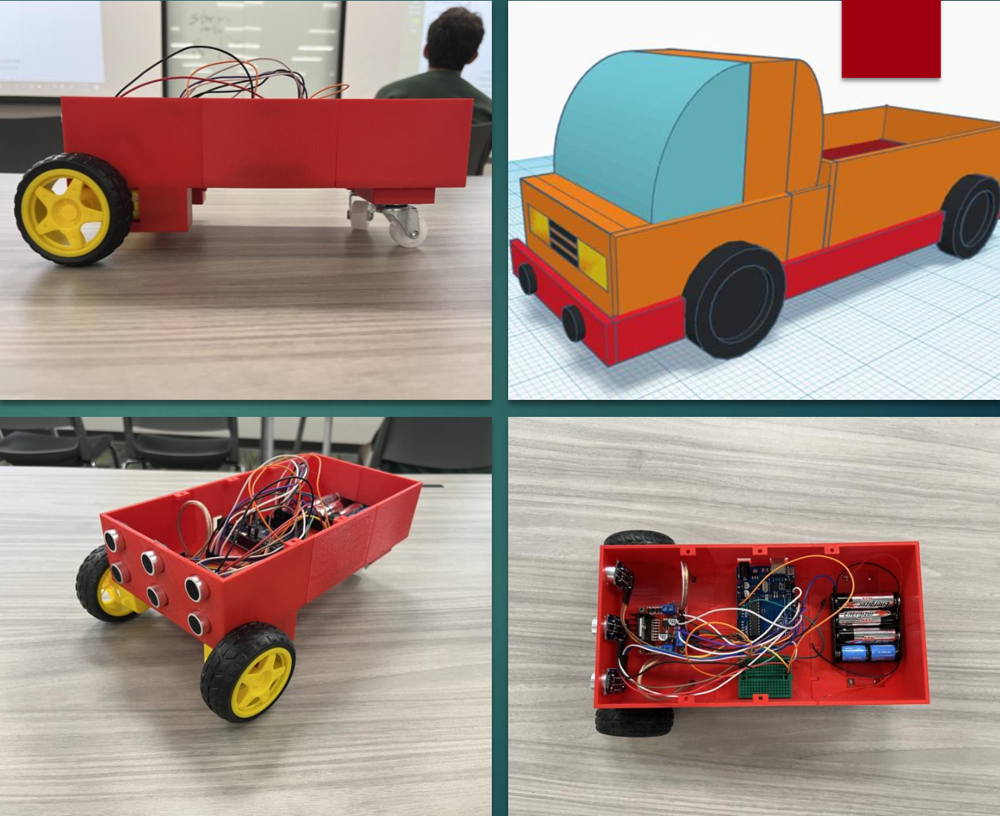

# Autonomous Arduino Dump Truck

<div align="center">
  


**An educational hands-on robotics project designed for K-12 students to learn engineering principles**

[🎥 Watch Demo](https://www.youtube.com/watch?v=MdCv9IWylZ0) • [📄 Full Documentation](docs/Showcase_Portfolio.pdf) • [⚡ Quick Start](#-quick-start)

[](https://www.arduino.cc/)
[](https://docs.arduino.cc/arduino-cloud/guides/arduino-c/)


</div>

---

## 📋 Table of Contents

- [Overview](#-overview)
- [Demo](#-demo)
- [Features](#-features)
- [Quick Start](#-quick-start)
- [Hardware Components](#-hardware-components)
- [Installation & Setup](#-installation--setup)
- [How It Works](#-how-it-works)
- [Code Structure](#-code-structure)
- [Technical Specifications](#-technical-specifications)
- [Educational Value](#-educational-value)
- [Troubleshooting](#-troubleshooting)
- [Future Improvements](#-future-improvements)
- [Project Credits](#-project-credits)
- [License](#-license)

---

## 🤖 Overview

This project features an autonomous dump truck that uses **three ultrasonic sensors** for 360-degree obstacle detection, enabling the vehicle to navigate its environment intelligently while avoiding collisions. The truck uses **differential steering** for precise turning control and includes **audio feedback** for enhanced user interaction.

**Perfect for:** K-12 STEM education, robotics workshops, engineering demonstrations

---

## 🎥 Demo

**Watch the truck in action:**

[](https://www.youtube.com/watch?v=MdCv9IWylZ0)

> Click to watch full video demonstration

**Key Features Demonstrated:**
- ✅ Autonomous obstacle avoidance
- ✅ Smart turning based on sensor data comparison
- ✅ Audio feedback system
- ✅ Real-time navigation decisions

---

## ✨ Features

### 🎯 Triangulated Ultrasonic Sensors
Three HC-SR04 sensors provide complete frontal coverage:
- **Left sensor**: Detects obstacles on the left side
- **Center sensor**: Primary forward-facing collision detection
- **Right sensor**: Detects obstacles on the right side

### 🤖 Autonomous Navigation
Intelligent decision-making based on sensor fusion:
- Automatic obstacle avoidance
- Smart turning logic comparing left vs. right clearance
- Dynamic speed control based on obstacle proximity

### 🔊 Audio Feedback
Horn/buzzer provides audio cues during operation:
- Sounds when backing up
- Alert tones for different maneuvers

### 🎮 Differential Steering
Independent motor control for precise turning:
- Forward/backward movement
- Left/right turning
- Stop functionality

---

## ⚡ Quick Start

**Want to run this right now?**

```bash
# 1. Clone the repo
git clone https://github.com/ramkan12/Arduino-Dumptruck.git
cd Arduino-Dumptruck

# 2. Open in Arduino IDE
# File → Open → arduino_dump_truck.ino

# 3. Select your board
# Tools → Board → Arduino Uno

# 4. Select your port
# Tools → Port → (your Arduino port)

# 5. Upload!
# Sketch → Upload (or Ctrl+U / Cmd+U)
```

**That's it!** Place your truck on a flat surface and watch it navigate autonomously! 🚀

---

## 🛠️ Hardware Components

**Electronics:**
- Arduino Uno microcontroller
- 2× DC motors with H-Bridge driver
- 3× HC-SR04 ultrasonic sensors
- Piezo buzzer speaker
- Breadboard for connections

**Power & Mechanical:**
- 15V power (Lithium-ion + Alkaline batteries)
- 4× yellow wheels with differential steering
- 3D-printed PLA chassis (10" × 5" × 7")
- LEDs, resistors, capacitors

**Total Cost:** ~$26 (economical for educational use)

<details>
<summary><b>📦 Complete Bill of Materials (Click to expand)</b></summary>

| Component | Cost |
|-----------|------|
| Arduino Uno | $4.27 |
| H-Bridge Motor Driver | $2.00 |
| 3× HC-SR04 Sensors | $10.20 ($3.40 each) |
| Wheels (2-pack × 2) | $6.64 |
| Breadboard | $1.43 |
| PLA Filament | ~$1.00 |
| Battery Pack | $2.00 |
| Speaker/Buzzer | $0.50 |
| Resistors, Capacitors, LEDs | $2.62 |
| Screws and nuts | $0.09 |
| **Total** | **$25.95** |

</details>

---

## 📦 Installation & Setup

### Hardware Assembly

- [ ] Mount three ultrasonic sensors on the front of chassis (left, center, right)
- [ ] Connect H-Bridge motor driver to Arduino
- [ ] Wire DC motors to H-Bridge outputs
- [ ] Connect speaker to Pin 11
- [ ] Install battery pack (15V total)
- [ ] Secure all components inside the truck bed

### Software Upload

1. **Install Arduino IDE** → [Download here](https://www.arduino.cc/en/software)
2. **Clone this repository** or download the `.ino` file
3. **Open** `arduino_dump_truck.ino` in Arduino IDE
4. **Select Board**: Tools → Board → Arduino Uno
5. **Select Port**: Tools → Port → (your Arduino port)
6. **Upload**: Sketch → Upload (or Ctrl+U)

### First Run

1. Place truck on a **flat surface** with clear space ahead
2. **Power on** the Arduino
3. The truck will **immediately begin** autonomous operation
4. Observe the **serial monitor** (38400 baud) for sensor readings and debug info

<details>
<summary><b>📌 Pin Configuration (Click to expand)</b></summary>

### Ultrasonic Sensors
```
Sensor 1 (Left):   Trig: Pin 7, Echo: Pin 6
Sensor 2 (Center): Trig: Pin 4, Echo: Pin 5
Sensor 3 (Right):  Trig: Pin 2, Echo: Pin 3
```

### Motor Control (H-Bridge)
```
Motor A: IN1 (Pin 8), IN2 (Pin 9)
Motor B: IN3 (Pin 12), IN4 (Pin 13)
PWM: ENA (Pin 10)
```

### Audio
```
Speaker/Buzzer: Pin 11
```

</details>

---

## 🧠 How It Works

### Navigation Logic

The truck uses a **decision tree** based on real-time sensor data:

1. **Obstacle Detection**: All three sensors continuously measure distances
2. **Decision Making**:
   - **Close obstacle (≤20cm)**: Back up and sound horn 🔊
   - **Medium distance (≤25cm)**: Stop temporarily ⏸️
   - **Safe distance (≤100cm)**: Move forward slowly ➡️
   - **Clear path (>100cm)**: Compare sensors and turn toward clearer side ↩️

3. **Turning Logic**:
   - If **left sensor** detects more clearance (>3cm difference): Turn **right** ↪️
   - If **right sensor** detects more clearance (>3cm difference): Turn **left** ↩️
   - Otherwise: Move **forward** ⬆️

### Sensor Data Processing

Each ultrasonic sensor:
- Sends a **10-microsecond pulse**
- Measures **echo return time**
- Calculates distance: `distance (cm) = time (μs) / 29 / 2`
- Updates **every loop cycle** for real-time response

---

## 💻 Code Structure

```cpp
// Main Functions
void loop()           // Main control loop - runs continuously
void forward()        // Move truck forward
void backward()       // Move truck backward
void left()           // Turn left (differential steering)
void right()          // Turn right (differential steering)
void Stop()           // Stop all motors

// Sensor Functions
float sensorOne()     // Read left sensor distance
float sensorTwo()     // Read center sensor distance
float sensorThree()   // Read right sensor distance
```

**Key Variables:**
- `MotorSpeed`: PWM value for motor speed (default: 70/255)
- `trigPin1/2/3`: Trigger pins for ultrasonic sensors
- `echoPin1/2/3`: Echo pins for ultrasonic sensors
- `IN1-IN4`: H-Bridge motor control pins

---

## 📊 Technical Specifications

| Specification | Value |
|--------------|-------|
| **Dimensions** | 10" × 5" × 7" |
| **Weight** | 1800g |
| **Turn Radius** | 60° |
| **Speed** | 7 cm/s |
| **Storage Size** | 5" × 5" × 5" |
| **Power** | 15V (dual battery) |
| **Sensors** | 3× ultrasonic (360° frontal coverage) |
| **Motor Speed** | PWM controlled at 70/255 |
| **Safety Rating** | 9/10 |
| **Operation Rating** | 8/10 |

---

## 🎓 Educational Value

This project teaches students:

**Programming Concepts:**
- C++ syntax and structure
- Conditional logic (if/else statements)
- Functions and modular code design
- Sensor data processing and interpretation
- Real-time decision making algorithms

**Engineering Principles:**
- Arduino microcontroller interfacing
- H-Bridge motor control circuits
- Ultrasonic sensor operation and physics
- Differential steering mechanics
- Autonomous navigation algorithms

**Additional Learning:**
- 🔬 **Physics**: Ultrasonic wave propagation, distance calculation
- 🔌 **Electronics**: Circuit design, power management, PWM signals
- 🛠️ **Mechanical**: Motor control, steering systems, 3D printing
- 🤔 **Problem Solving**: Debugging, iteration, optimization

**Target Audience:** K-12 students (with instructor guidance)

---

## 🔧 Troubleshooting

<details>
<summary><b>❌ Truck doesn't move</b></summary>

**Possible causes:**
- Check battery connections and charge level
- Verify motor wiring to H-Bridge (correct polarity)
- Ensure Arduino is powered and sketch uploaded
- Test motors independently with simple code

</details>

<details>
<summary><b>❌ Erratic sensor readings</b></summary>

**Possible causes:**
- Verify sensor wiring (Trig/Echo pins)
- Ensure sensors have clear line of sight
- Check for loose connections
- Serial monitor (38400 baud) should show consistent distance values

</details>

<details>
<summary><b>❌ Wheels slipping</b></summary>

**Possible causes:**
- Reduce motor speed in code: `#define MotorSpeed 50` (lower value)
- Check surface friction (carpet works better than smooth floors)
- Verify equal power to both motors
- Ensure wheels are properly attached to motor shafts

</details>

<details>
<summary><b>❌ No audio feedback</b></summary>

**Possible causes:**
- Confirm speaker connection to Pin 11
- Check speaker polarity (if applicable)
- Verify `tone()` function calls in code
- Test with a simple tone sketch

</details>

---

## 🚀 Future Improvements

Potential enhancements for v2.0:

- [ ] Add **motorized dump bed** mechanism (currently manual)
- [ ] Implement **line-following** capability with IR sensors
- [ ] Add **Bluetooth/WiFi** remote control option
- [ ] Expand to **5+ sensors** for complete 360° coverage
- [ ] Integrate **LED indicators** for status visualization
- [ ] Add **data logging** to SD card for movement analysis
- [ ] Implement **obstacle mapping** and intelligent path planning
- [ ] Create **mobile app** for real-time monitoring and control

---

## 👥 Project Credits

**Team Supreme - Group #9** 🏆

| Team Member | Role |
|-------------|------|
| **Riham Khan** | Navigation Logic & Sensor Integration |
| **Dominic Lobosco** | Hardware Assembly & Testing |
| **Maryam Ashraf** | Chassis Design & 3D Modeling |
| **Natalie Geer** | Documentation & Presentation |
| **Jared Relao** | Circuit Design & Wiring |

---

## 📄 License

This project is **open-source** and available for educational use. Feel free to modify and adapt for your own learning purposes.

**MIT License** - See [LICENSE](LICENSE) file for details

---

## 📚 Demo & Resources

- **🎥 Video Demo**: [Watch on YouTube](https://www.youtube.com/watch?v=MdCv9IWylZ0)
- **📄 Full Documentation**: [Showcase Portfolio PDF](docs/Showcase_Portfolio.pdf)
- **💬 Questions?**: Open an [issue](https://github.com/ramkan12/Arduino-Dumptruck/issues)

---

<div align="center">

**Built with ❤️ for STEM Education**

⭐ **Star this repo** if you found it helpful!

[](https://github.com/ramkan12/Arduino-Dumptruck/stargazers)
[](https://github.com/ramkan12/Arduino-Dumptruck/network/members)

</div>
